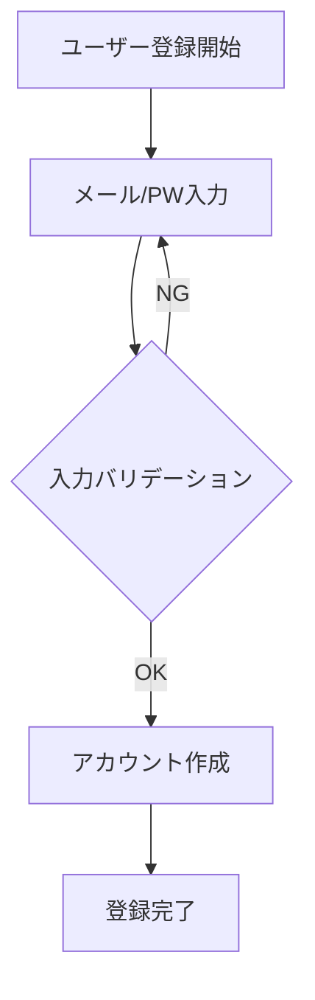

# 機能フロー図

## 機能サマリー（参照）

| 機能名 | 権限 | 内容 | 補足 | 該当ページ |
|--------|------|------|------|------------|
| 例) ユーザー登録 | 一般ユーザー | メール・PWで新規登録 | 規約同意必須 | /signup |

## フロー（Mermaid）

```mermaid
flowchart TD
  A[ユーザー登録開始] --> B[メール/PW入力]
  B --> C{入力バリデーション}
  C -- OK --> D[アカウント作成]
  C -- NG --> B
  D --> E[登録完了]
```
